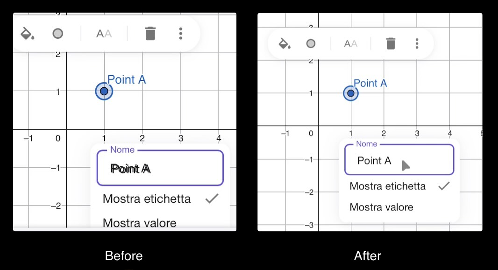

# geogebra-ipados-text-fix

Fix issues while editing object names or while adding custom text on GeoGebra. Intended for iPadOS and/or iOS. It should have no effect on desktop devices.

Download it from GreasyFork: https://greasyfork.org/en/scripts/552823-geogebra-ipados-text-fix

## What this does:

Normally, all GeoGebra web apps on iPadOS has two issues:

- While editing the object names, or saving the file, the textbox value appears to be duplicated;
- While editing the object names, the textbox overflows if spaces are added;
- It's not possible to write anything with an external keyboard using the "Text" object.

This Userscript aims to fix that.

 Here you can see the "Before" and "After" for editing the object names:

